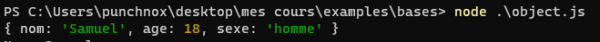

# Les Objets

## Objectif
Comprendre et maitriser les Objets en JavaScript et Node.js, savoir à quoi ils servent, comment les utiliser, quand les utiliser...

## Les Objets
Un objet est une collection de noms et de valeurs, les objets sont très utiles en programmation car ils permettent de stocker plusieurs valeurs dans une seule variable ou constante.

**Pour créer un objet, il suffit d'utiliser les accolades `{}` et de mettre les valeurs à l'intérieur, exemple:**

- *1ère méthode:*
```js
const person = {//on défini l'object "person"
    nom: "Samuel",
    age: 18,
    sexe: "homme"
}
```

Comme on la vu précédemment avec les tableaux on peut définir un objet de la même manière:

- *2eme méthode:*
```js
const person = new Object({//on défini l'object "person"
    nom: "Samuel",
    age: 18,
    sexe: "homme",
    hobbies: ["développement", "electronique", "robotique"]
})
```


si on affiche l'objet dans la console on aura:


/!\ **Vous pouvez mettre ce que vous voulez dans un object, des nombres (Number), des chaines de caractères (String), des tableaux (Array), des objets (Object), des fonctions (Function), des classes (Class), des modules (Module)...**

### Comment les utiliser
Maintenant qu'on a vu comment créer un objet, on va pouvoir commencer à les utiliser et les mettre en pratique.

Pour accéder à une valeur dans un objet, il suffit de mettre le nom de la valeur après le nom de l'objet, exemple:

```js
const person = {
    nom: "Samuel",
    age: 18,
    sexe: "homme"
}

nom = person.nom//on accède à la valeur "nom" de l'objet "person"

console.log(nombre)//affiche "Samuel"

console.log(person.age)//affiche 18
```

Comme vous pouvez le remarquer c'est assez pratique et cela vous permettra de stocker de multiples informations dans une seule variable ou constante tout en organisant vos données.


## Les méthodes
Les objets possèdent plusieurs méthodes, les méthodes sont des fonctions qui permettent de manipuler les objets.

---

### Ajouter une valeur
**Pour ajouter une valeur à un objet, il y a plusieurs façons de faire mais je compte vous montrer les deux plus utilisées:**

- *1ère méthode:* ( consiste à mettre le nom de la nouvelle valeur après le nom de l'objet et de lui donner une valeur, exemple: )

```js
var person = {
    nom: "Samuel",
    age: 18,
    sexe: "homme"
}

person.pays = "France"//on ajoute la propriété pays avec la valeur "France" à l'objet person

console.log(person)//Résultat: { nom: 'Samuel', age: 18, sexe: 'homme', pays: 'France' }
```


- *2eme méthode:* ( consiste à utiliser la méthode `assign()` et de mettre l'objet à modifier en premier paramètre et l'objet à ajouter en deuxième paramètre, exemple: )

*Cette méthode est moins utilisé vous n'êtes pas obligé de l'apprendre si vous maitrisez déjà celle qui est au dessus, apprenez ce qui vous intéresse et le reste vous verrez plus tard*

```js
var person = {
    nom: "Samuel",
    age: 18,
    sexe: "homme"
}

var person2 = {
    pays: "France"
}

Object.assign(person, person2)//on ajoute l'objet person2 à l'objet person

console.log(person)//Résultat: { nom: 'Samuel', age: 18, sexe: 'homme', pays: 'France' }
```

### Supprimer une valeur
Pour supprimer une valeur à un objet il suffit de mettre le nom de la valeur après le nom de l'objet et de mettre `delete` devant, exemple:

```js
var person = {
    nom: "Samuel",
    age: 18,
    sexe: "homme"
}

delete person.nom//supprime la valeur "nom" de l'objet "person"

console.log(person)//affiche: { age: 18, sexe: 'homme' }
```

### Modifier une valeur
**Pour modifier une valeur dans un objet, il suffit de mettre le nom de la valeur après le nom de l'objet et de lui donner une nouvelle valeur, exemple:**

```js
var person = {
    nom: "Samuel",
    age: 18,
    sexe: "homme"
}

person.nom = "punchnox"//je modifie la valeur de "nom" par "punchnox"

console.log(person)//affiche { nom: 'punchnox', age: 18, sexe: 'homme' }
```

### Les méthodes utiles
Dans les exemple ci-dessous, je pars du principe qu'on utilise l'objet person pour éviter d'avoir à le réécrire à chaque fois.

Les objets possèdent plusieurs méthodes utiles, je vais vous montrer les plus utilisées:

- `Object.keys()` ( permet de récupérer les noms des valeurs d'un objet, exemple: )

```js
console.log(Object.keys(person))//affiche: [ 'nom', 'age', 'sexe' ]
```

- `Object.values()` ( permet de récupérer les valeurs d'un objet, exemple: )

```js
console.log(Object.values(person))//affiche: [ 'Samuel', 18, 'homme' ]
```

- `Object.entries()` ( permet de récupérer les noms et les valeurs d'un objet, exemple: )

```js
console.log(Object.entries(person))//affiche: [ [ 'nom', 'Samuel' ], [ 'age', 18 ], [ 'sexe', 'homme' ] ]
```

- `Object.assign()` ( permet de fusionner deux objets, exemple: )

```js
var person2 = {
    pays: "France"
}

console.log(Object.assign(person, person2))//affiche: { nom: 'Samuel', age: 18, sexe: 'homme', pays: 'France' }
```

#### Facultatif

- `Object.freeze()` ( permet de rendre un objet immuable, exemple: )

```js
Object.freeze(person)//rend l'objet "person" constant

person.nom = "punchnox"//on essaye de modifier la valeur "nom" de l'objet "person"

console.log(person)//affiche: { nom: 'Samuel', age: 18, sexe: 'homme' }
```

- `Object.seal()` ( permet de rendre un objet scellé, exemple: )

```js
Object.seal(person)//rend l'objet "person" scellé

person.nom = "punchnox"//on essaye de modifier la valeur "nom" de l'objet "person"

console.log(person)//affiche: { nom: 'punchnox', age: 18, sexe: 'homme' }
```


## Conclusion
Comme vous avez du comprendre les objets sont très utiles, surtout qu'ils permettent de stocker d'autres choses que de simples valeurs comme des fonctions par exemple, vous pouvez trier tout vos codes dans des objets pour les réutiliser dans d'autres fichiers sans tout réecrire à chaque fois ( on le verra dans le cours sur les modules )

Si vous voulez vous entrainer je mettrai à disposition des exercices sur les objets dans le dossier "exercices" de ce repo github.

## Auteur
- [punchnox](https://github.com/notpunchnox)


Cours suivant : [Les boucles en JavaScript.](../bases/boucles.md)