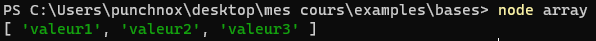

# Les tableaux

## Objectif
Maitriser et mettre en oeuvre les bases des `Tableaux`.


## Les tableaux
Un tableau est une liste de valeurs, les tableaux sont très utiles en programmation car ils permettent de stocker plusieurs valeurs dans une seule variable ou constante.

**Pour créer un tableau, il suffit d'utiliser les crochets `[]` et de mettre les valeurs à l'intérieur, exemple:**

- *1ère méthode:*
```js
const monTableau = ["valeur1", "valeur2", "valeur3"]
```

**Important** Un tableau en Javascript se nomme `Array`, vous pouvez aussi définir un tableau de cette manière:

- *2eme méthode:*
```js
const monTableau = new Array("valeur1", "valeur2", "valeur3")
```

si on affiche le tableau dans la console on aura:



## Comment les utiliser
Pour accéder à une valeur dans un tableau, il suffit de mettre l'emplacement de la valeur entre les crochets `[]` après le nom de la variable ou de la constante, exemple:

```js
const monTableau = ["valeur1", "valeur2", "valeur3"]

console.log(monTableau[0])//affiche "valeur1"
```

/!\ **Attention** Les tableaux commencent à partir de 0, donc si vous voulez accéder à la première valeur du tableau il faudra mettre 0 entre les crochets `[]` et non 1.

## Les méthodes
Les tableaux possèdent plusieurs méthodes, les méthodes sont des fonctions qui permettent de manipuler les tableaux.

---

### Ajouter une valeur
**Pour ajouter une valeur à un tableau, il suffit d'utiliser la méthode `push()` et de mettre la valeur à l'intérieur des parenthèses `()`, exemple:**

```js
var fruits = ["pomme", "banane"]

fruits.push("orange")//ajoute la valeur "orange" au tableau

console.log(fruits)//Résultat: ["pomme", "banane", "orange"]
```

### Supprimer une valeur
Pour supprimer une valeur à un tableau il y a plusieurs façons de faire:

**Supprimer le première element du tableau `shift()`, exemple:**
```js
var fruits = ["pomme", "banane", "orange"]//on utilise une variable car on veut modifier le tableau

fruits.shift()//supprime le premier élément du tableau
console.log(fruits)//Résultat: ["banane", "orange"]
```

**Supprimer le dernier element du tableau `pop()`, exemple:**
```js
var fruits = ["pomme", "banane", "oranges"]

fruits.pop()//supprime le dernier élément du tableau
console.log(fruits)//Résultat: ["pomme", "banane"]
```

**Supprimer un element du tableau `splice()`, exemple:**
```js
var fruits = ["pomme", "banane", "orange"]

fruits.splice(1, 1)//supprime l'élément à l'emplacement 1 du tableau
console.log(fruits)//Résultat: ["pomme", "orange"]
```

**Supprimer plusieurs elements d'un tableau `splice()`, exemple:**
```js
var fruits = ["pomme", "banane", "orange"]

fruits.splice(1, 2)//supprime 2 éléments à partir de l'emplacement 1 du tableau
console.log(fruits)//Résultat: ["pomme"]
```
Quand vous utilisez `splice()` pour supprimer un ou des elements, il faut savoir que le premier paramètre est l'emplacement de l'élément à supprimer et le deuxième paramètre est le nombre d'éléments à supprimer

`Tableau.splice(emplacement, nombre d'éléments à supprimer)`

### Modifier une valeur
**Pour modifier une valeur dans un tableau, il faut utiliser `splice()` et mettre l'emplacement de la valeur à modifier, exemple:**

```js
var fruits = ["pomme", "banane", "orange"]

fruits.splice(1, 1, "fraise")//modifie la valeur à l'emplacement 1 du tableau par "fraise"
console.log(fruits)//Résultat: ["pomme", "fraise", "orange"]
```

### Trouver une valeur
**Avec JavaScript vous avez aussi la possibilité de trouver l'emplacement d'une valeur dans un tableau, pour ce faire il faut utiliser la méthode `indexOf()`, exemple**

```js
var fruits = ["pomme", "banane", "orange"]

console.log(fruits.indexOf("pomme"))//Résultat: 0
```

### Savoir si un element est dans le Tableau
Vous avez aussi la possibilité de savoir si une valeur donné est dans un tableau ( c'est utilisé assez régulièrement ), pour ce faire il suffit d'utiliser la fonction `includes`

**Cette fonction retourneras un boolean ( true ou false ) donc vrai ou faux**

exemple:

```js
var fruits = ["pomme", "banane", "orange"]

const résultat = fruits.includes("banane")
console.log(résultat)//Résultat: true

if(résultat) {//si le résultat est égale à true alors...
    console.log("La valeur est dans le tableau")
} else {//si le résultat n'est pas égale à true alors...
    console.log("La valeur n'est pas dans le tableau")
}
```

### Compter le nombre d'elements dans un tableau
Pour finir nous avons la possibilité de compter le nombre d'elements dans un tableau, la méthode que je vais vous montrer vous permettra aussi de voir plus loin qu'un simple tableau et vous pourrez compter le nombre de caracteres dans un mot par exemple et bien d'autres encore...


**Pour compter le nombre d'elements dans un tableau, il faut utiliser la méthode `length`, exemple:**

```js
var fruits = ["pomme", "banane", "orange"]

console.log(fruits.length)//Résultat: 3
```

Je fais une petite parenthèse pour vous montrer que vous pouvez aussi compter le nombre de caracteres dans un mot, exemple:

```js
var mot = "Bonjour"

console.log(mot.length)//Résultat: 7
```


## Conclusion
Vous avez maintenant les bases pour utiliser et maitriser les tableaux, je vous conseil de vous entrainer à les utiliser et à coder quelques petits programmes pouvant utiliser des tableaux, je metterai à vôtre disposition des exercices dans la partie `Exercices` de ce cours.

J'ai aussi mis à disposition des exemples dans la partie `Examples`, [cliquez ici pour y accéder](../../examples/bases/tableaux.js)


Cours suivant: [Les objets en JavaScript.](./objets.md)


## Auteur
- [punchnox](https://github.com/notpunchnox)