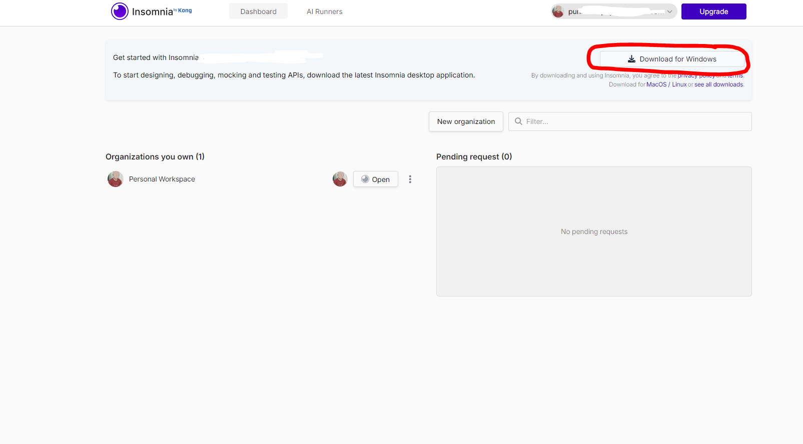
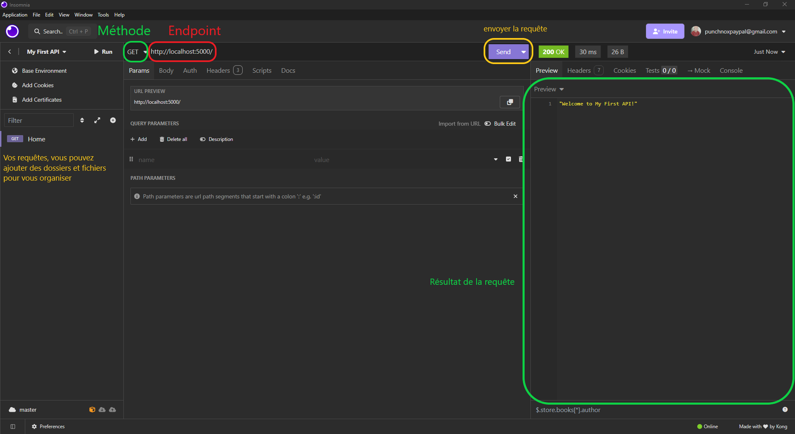

Voici une version améliorée et mieux structurée de votre fichier Markdown :

---

# Insomnia REST

Dans ce cours, vous apprendrez à utiliser **Insomnia REST**, un outil similaire à Postman qui permet d'interagir avec vos API REST de manière simple et intuitive.

---

## 1. Installation

### Étape 1 : Télécharger Insomnia
1. Rendez-vous sur le [site officiel d'Insomnia](https://insomnia.rest/).
2. Créez un compte si ce n’est pas déjà fait.
3. Téléchargez le logiciel en cliquant sur le bouton **Download**, comme illustré ci-dessous, et suivez les instructions d'installation :

---

## 2. Démarrage avec Insomnia

### Étape 1 : Lancer Insomnia
Après l'installation, lancez Insomnia. Vous arriverez sur la page d'accueil du tableau de bord :

### Étape 2 : Créer une collection
Une **collection** regroupe les requêtes que vous testez dans Insomnia. Pour créer une collection :
1. Cliquez sur **Create** ou sur l'icône de collection.
2. Donnez un nom à votre collection (par exemple : "Test API").

Voici une illustration de cette étape :

---

## 3. Tester une API REST

Pour tester une API, vous devez en disposer d’une. Si vous n’avez pas encore d’API, vous pouvez suivre ce [cours pour créer une API avec Express](./express.md).

### Étape 1 : Ajouter une requête
1. Sélectionnez votre collection.
2. Cliquez sur **New Request** pour créer une nouvelle requête.
3. Donnez un nom à la requête (par exemple : "Liste des utilisateurs").
4. Choisissez le type de requête (GET, POST, PUT, DELETE, etc.).
5. Saisissez l'URL de l'endpoint (par exemple : `http://localhost:5000/api/utilisateurs`).

Voici une illustration pour créer une requête :

### Étape 2 : Exemple de requête GET
Voici un exemple d'une requête **GET** sur l'endpoint `/api/utilisateurs` de l'API précédente.

#### Détails de la requête :
- **Méthode** : GET
- **URL** : `http://localhost:5000/api/utilisateurs`
- **Résultat attendu** : Une liste des utilisateurs au format JSON.

#### Capture d'écran
Voici un aperçu des informations principales :

---

## Résumé

Avec Insomnia, vous pouvez :
- Tester vos endpoints API (GET, POST, PUT, DELETE).
- Créer et organiser des collections pour regrouper vos requêtes.
- Vérifier rapidement les résultats et les réponses des API.

Si vous n’avez pas encore d’API à tester, reportez-vous au cours précédent : [Créer une API REST avec Express](../../cours/api/express.md).